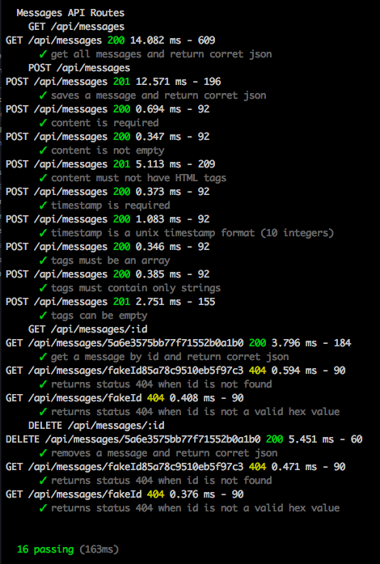

# Express MongoDB Exercise

With this Node.js application a user can interact via REST API, accessed via HTTP requests requiring and returning data in JSON format.

#### Architecture used:
- Node.js + Express
- MongoDB + Monk
- Mocha + Chai

#### How to run on your local machine:
Using terminal: (Assuming Node.js and MongoDB is already installed)
- Clone this repository `git clone https://github.com/srMarquinho/express-mongodb-api`
- Navigate to the repo directory `cd express-mongodb-api`
- Install dependencies `npm install`
- Run the database server `npm run mongod` on a separated terminal.
- Run the server `npm start`

#### Tests:
Behaviour Driven Development
- Run `npm test`

#### Usage example - How to interact locally:
Using CURL:
- *Get all messages:* `curl -X GET http://localhost:3000/api/messages -H 'content-type: application/json'`
- *Create message:* `curl -X POST http://localhost:3000/api/messages -H 'content-type: application/json' -d '{ "content": "This is an example message", "timestamp": 1509104272, "tags": ["important", "private", "draft"] }'`
- *Get message:* `curl -X GET http://localhost:3000/api/messages/<_id> -H 'content-type: application/json'`
- *Delete message:* `curl -X DELETE http://localhost:3000/api/messages/<_id> -H 'content-type: application/json'`

#### Where to:
- Consider moving from Monk to Mongoose as the app grows.
- Improve user experience adding specific error and validation messages.
- Add the Update feature.
- Add a User Interface so the user can View, Create, Remove, Update and Delete messages from the browser.
- Add user login.
- Add Unit Tests
- A couple of TODOs in code:
  - id is ignored as it is auto-generated - check if it should fail and message the user
  - check if sanitizing the content is enough or if it should fail and message the user if it has HTML tags
  - move necessary code to its own file such as Message model

